# Excel 居然可以这么玩
> 陈 希章 https://365pro.xizhang.com


## 免责声明 & 反馈讨论

> **以下分享为个人经验，不代表官方意见。**

本教程的反馈以及问题讨论，我委托第三方开通了一个企业微信号，将利用业余时间给与解答。


## Excel 是用来做什么的
<!-- _backgroundColor: azure -->

Excel 是历史悠久、功能强大的电子表格软件。它可用来存储数据、计算公式，分析和展示数据。它在全世界拥有大量的用户，他（她）们经常以 `表哥` 或 `表姐` 相称，展现出 `天下 Excel 用户是一家` 的美好动人的情景。

> 基本用法 https://support.microsoft.com/zh-cn/office/excel-%E8%A7%86%E9%A2%91%E5%9F%B9%E8%AE%AD-9bc05390-e94c-46af-a5b3-d7c22f6990bb

## 智能数据分析
1. 分析数据
1. 快速填充
1. 数据类型


### 分析数据
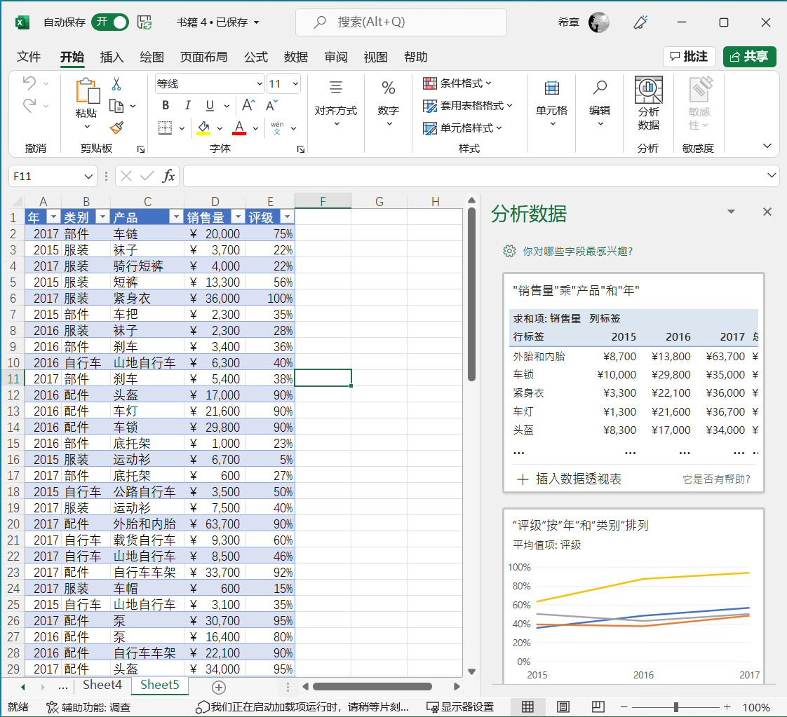
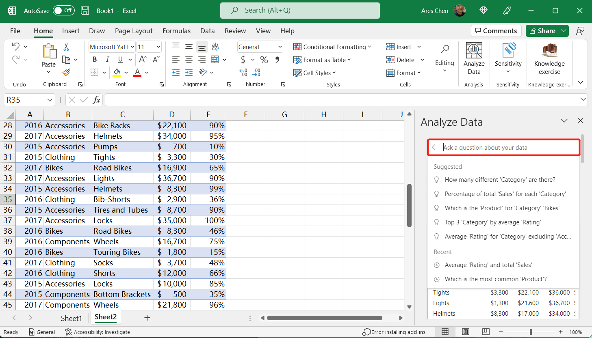

1. 自动提供建议
1. 一键插入内容
1. 自然语言查询（英文）

    

### 快速填充

自动识别数据的范式，进行智能填充

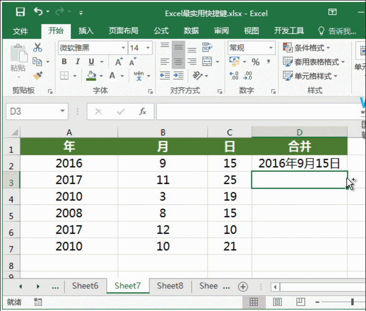

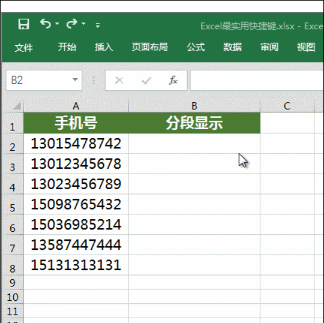


快捷键：`CTRL+E`


### 数据类型

1. 股票数据类型 [默认范例]
1. 自定义数据类型 [由PowerBI支持]

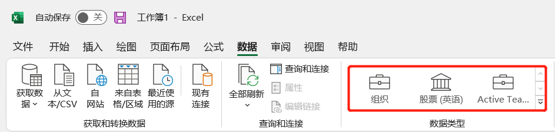
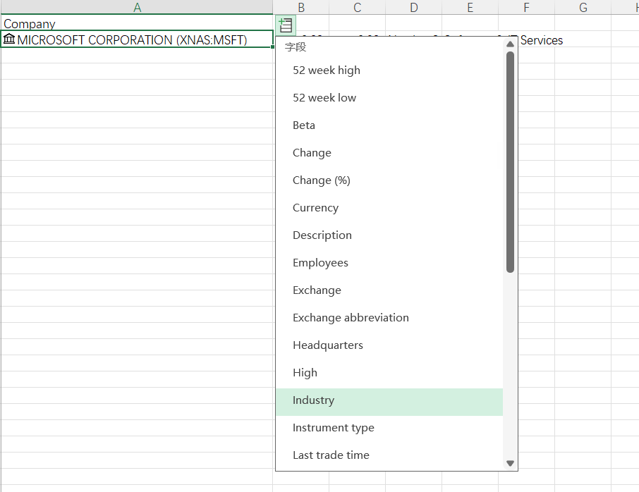

### 自定义数据类型
<!--定义推荐表格 https://docs.microsoft.com/zh-cn/power-bi/collaborate-share/service-create-excel-featured-tables -->
需要 Power BI 支持

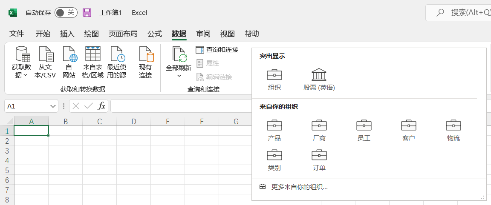
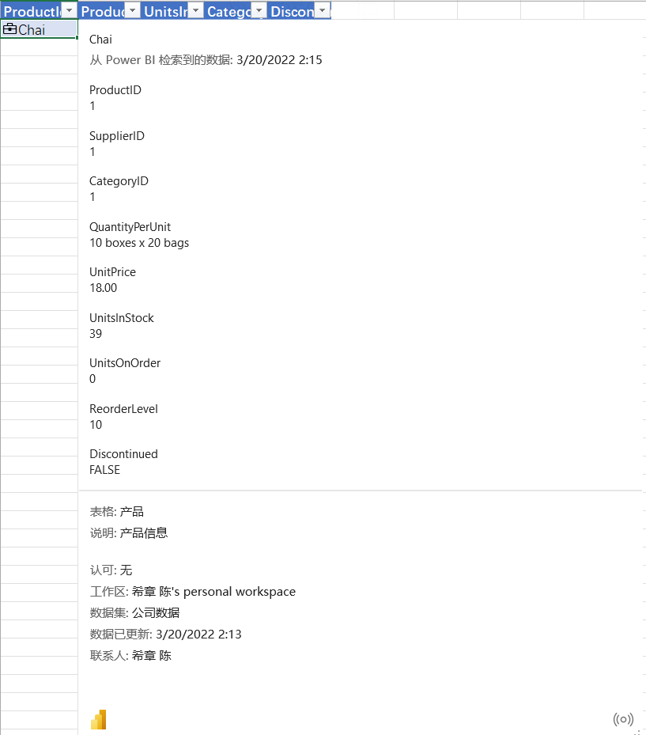

## 有意思的动态数组函数
<!-- 所有函数列表 https://support.microsoft.com/zh-cn/office/excel-functions-alphabetical-b3944572-255d-4efb-bb96-c6d90033e188 -->

<!-- 

通过几行命令可以获取最新的函数列表

$url ="https://support.microsoft.com/en-us/office/excel-functions-alphabetical-b3944572-255d-4efb-bb96-c6d90033e188"
[Net.ServicePointManager]::SecurityProtocol = [Net.SecurityProtocolType]::Tls12
$resp = iwr -Uri $url
$resp.ParsedHtml.images | Where-Object {$_.alt -like "Office 365*"} | Select-Object @{Name="Office 365 Function";Expression={$_.parentElement.firstChild.innerText}}

 -->


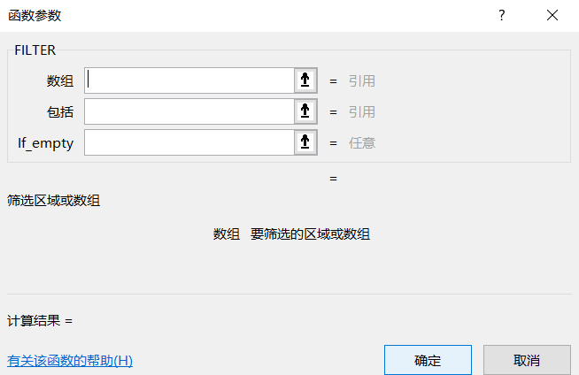
1. [FILTER](https://support.microsoft.com/zh-cn/office/filter-%E5%87%BD%E6%95%B0-f4f7cb66-82eb-4767-8f7c-4877ad80c759) 支持复杂条件高级筛选
1. [RANDARRAY](https://support.microsoft.com/zh-cn/office/randarray-%E5%87%BD%E6%95%B0-21261e55-3bec-4885-86a6-8b0a47fd4d33) 快速产生随机数组
1. [SEQUENCE](https://support.microsoft.com/zh-cn/office/sequence-%E5%87%BD%E6%95%B0-57467a98-57e0-4817-9f14-2eb78519ca90) 快速产生有序数组
1. [SORT](https://support.microsoft.com/zh-cn/office/sort-%E5%87%BD%E6%95%B0-22f63bd0-ccc8-492f-953d-c20e8e44b86c) 排序
1. [SORTBY](https://support.microsoft.com/zh-cn/office/sortby-%E5%87%BD%E6%95%B0-cd2d7a62-1b93-435c-b561-d6a35134f28f) 排序
1. [UNIQUE](https://support.microsoft.com/zh-cn/office/unique-%E5%87%BD%E6%95%B0-c5ab87fd-30a3-4ce9-9d1a-40204fb85e1e) 返回唯一值

## 其他专用函数

1. [LET](https://support.microsoft.com/zh-cn/office/let-%E5%87%BD%E6%95%B0-34842dd8-b92b-4d3f-b325-b8b8f9908999) 定义变量存储中间结果
1. [SWITCH](https://support.microsoft.com/zh-cn/office/switch-%E5%87%BD%E6%95%B0-47ab33c0-28ce-4530-8a45-d532ec4aa25e) 分支计算
1. [VALUETOTEXT](https://support.microsoft.com/zh-cn/office/valuetotext-%E5%87%BD%E6%95%B0-5fff61a2-301a-4ab2-9ffa-0a5242a08fea) 将值用文本输出
1. [ARRAYTOTEXT](https://support.microsoft.com/zh-cn/office/arraytotext-%E5%87%BD%E6%95%B0-9cdcad46-2fa5-4c6b-ac92-14e7bc862b8b) 将数组用文本输出
1. [XLOOKUP](https://support.microsoft.com/zh-cn/office/xlookup-%E5%87%BD%E6%95%B0-b7fd680e-6d10-43e6-84f9-88eae8bf5929) 查找
1. [XMATCH](https://support.microsoft.com/zh-cn/office/xmatch-%E5%87%BD%E6%95%B0-d966da31-7a6b-4a13-a1c6-5a33ed6a0312) 匹配

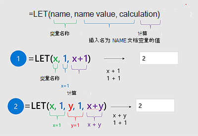

##  自动化脚本 (Javascript)

> 目前仅用于Excel网页版.

1. 录制脚本
1. 编辑脚本
1. 执行脚本
1. 分享脚本


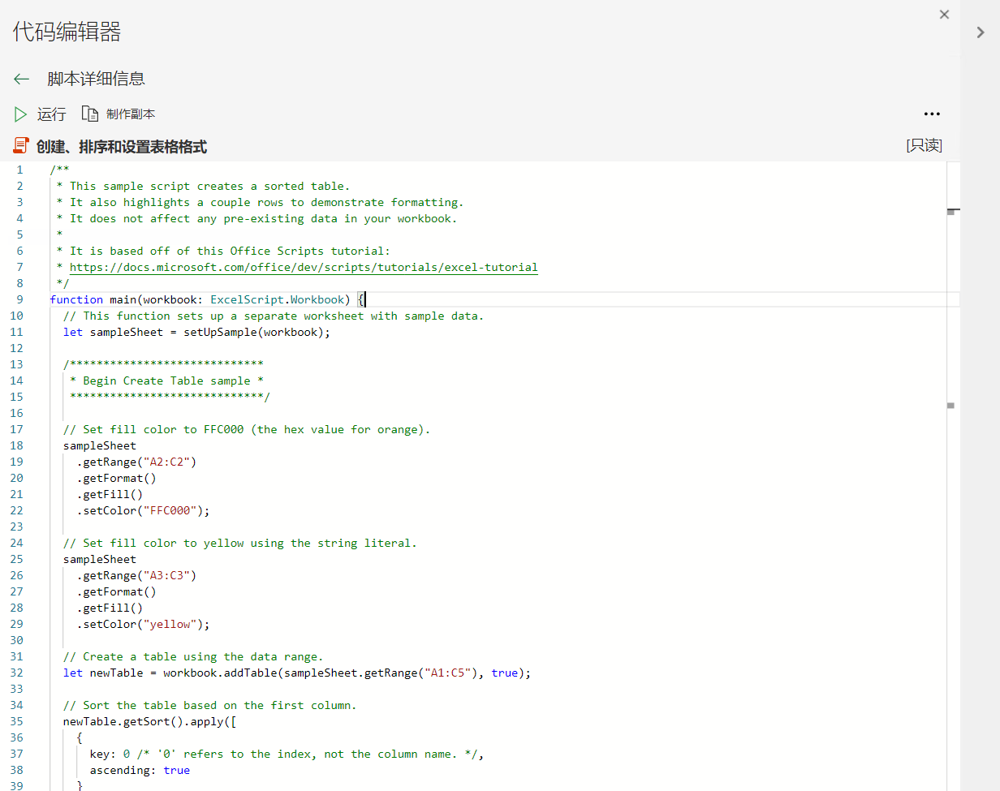

##  Excel as a Service

<!-- _footer: 详情参考 https://docs.microsoft.com/zh-cn/graph/api/resources/excel -->

1. 支持任何编程语言
1. 安全可靠，基于Oauth 身份验证
1. 访问和操作云端Excel文件
1. 支持下载文档或部分内容


## 利用PMT函数计算贷款数据

```powershell
# 安装PowerShell模块
Install-Module Microsoft.Graph -Scope CurrentUser

# 登录并授权
Connect-MgGraph -Scopes "Files.ReadWrite"
# 资源基地址
$baseUrl = "https://graph.microsoft.com/v1.0/me/drive/root:/pmt.xlsx:/workbook"

# 创建会话(非持久)
$session = Invoke-MgGraphRequest `
    -Method POST `
    -Uri "$($baseUrl)/createSession" `
    -ContentType "application/json" `
    -Body "{persistChanges:false}"

# 修改贷款金额
Invoke-MgGraphRequest -Method PATCH `
    -Uri "$($baseUrl)/worksheets/calculate/range(address='c7')" `
    -ContentType "application/json" `
    -Body "{values:[[700000]]}" `
    -Headers @{"workbook-session-id"=$session.id}
# 获取最新的每月还款金额
Invoke-MgGraphRequest -Method GET `
    -Uri "$($baseUrl)/worksheets/calculate/range(address='e4')" `
    -Headers @{"workbook-session-id"=$session.id}
```

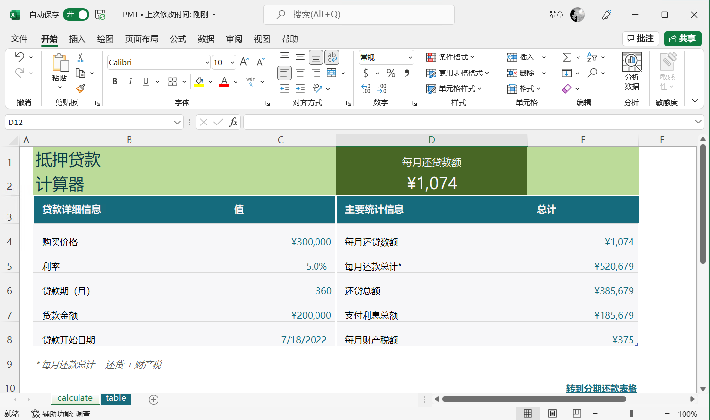