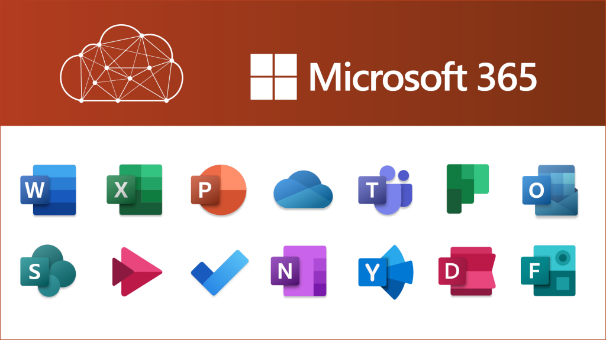
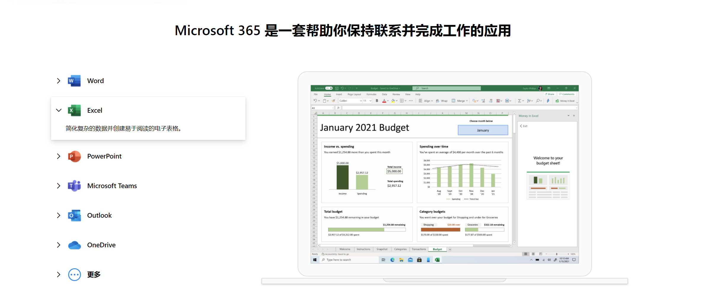
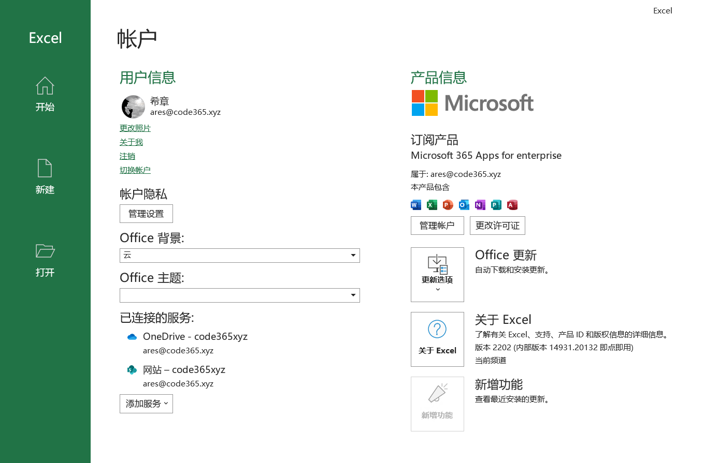
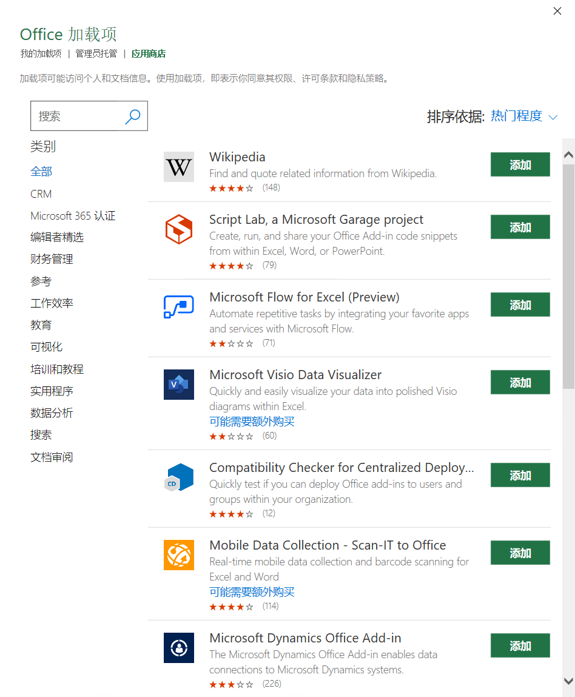
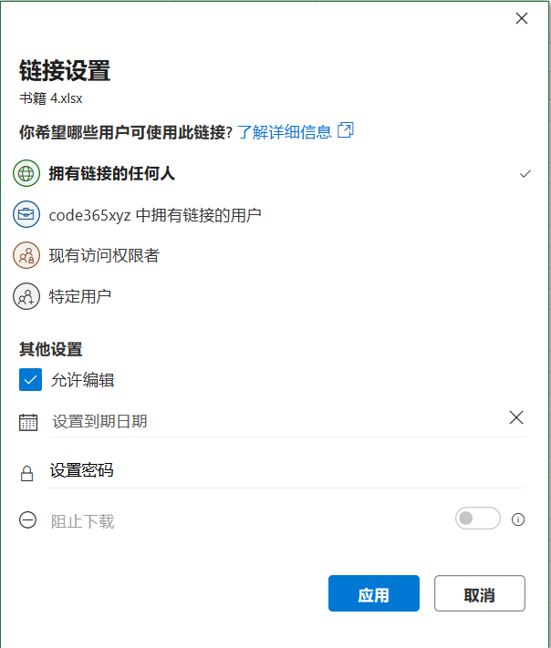
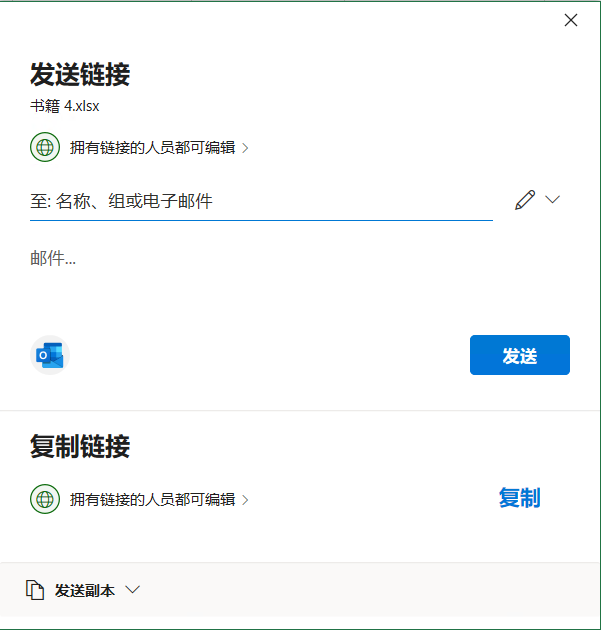
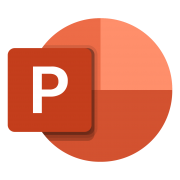
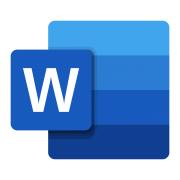
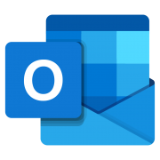

#  Microsoft 365   高手是怎样炼成的
> 陈 希章 https://365pro.xizhang.com

##  你是不是有这样的困惑
<!-- footer: Microsoft 365的高手是怎样炼成的 https://365pro.xizhang.com -->

1. 公司给我发了Microsoft 365账号，但我不知道到底跟以前的Office有啥区别？
1. 我已经熟练掌握基本使用，如何更进一步呢？

##  Microsoft 365 概述

<!-- _footer: 详情参考 https://www.microsoft.com/zh-cn/microsoft-365 -->
1. Office 365 + Windows + EMS 
1. 云服务 + 客户端 
1. 订阅，按需付费

##  账户和许可管理

1. 账户
1. 许可证
1. 更新
1. 隐私设置
1. 连接服务

##  加载项
<!-- _footer: https://appsource.microsoft.com/zh-cn -->

1. **获取加载项** (应用商店，管理员托管，我的加载项)
1. **使用加载项**（操作面板，内容组件，工具栏命令）

## 文档协作共享

1. 多人编辑
1. 文件共享
1. 批注，注释
1. 版本管理
1. 保护文件

## Excel 居然可以这么玩
https://365pro.xizhang.com/excel.html

## PowerPoint 居然可以这么玩
https://365pro.xizhang.com/powerpoint.html

## Word 居然可以这么玩
https://365pro.xizhang.com/word.html

## Outlook 居然可以这么玩
https://365pro.xizhang.com/outlook.html
