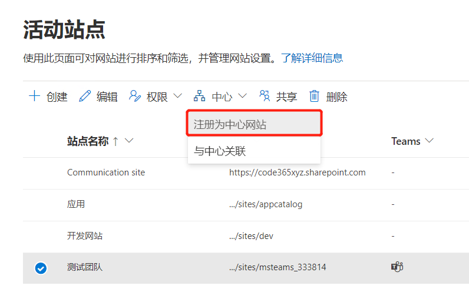
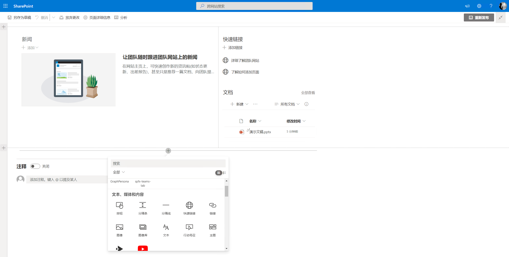
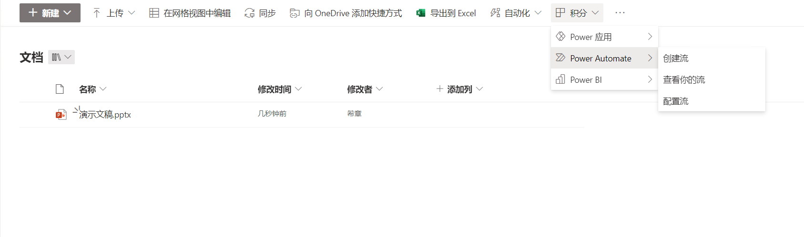
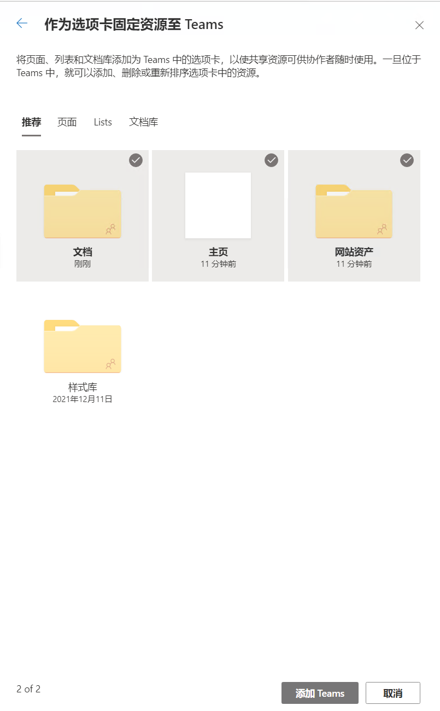
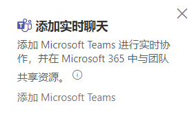
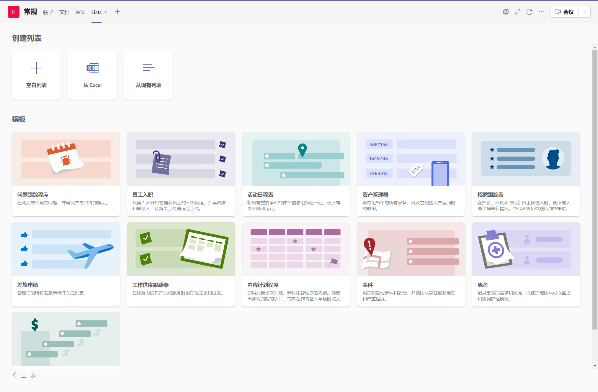

# SharePoint 居然可以这么玩
> 陈 希章 https://365pro.xizhang.com

## 免责声明 & 反馈讨论

> **以下分享为个人经验，不代表官方意见。**

## SharePoint 是用来做什么的
<!-- _backgroundColor: azure -->

SharePoint 同样有着悠久绵长的光辉历史，作为Microsoft 365中的现代化团队网站和内容管理解决方案，现在的 `SharePoint Online` 更是 `Teams` 的坚强后盾，深藏功与名。

> 基本使用 https://support.microsoft.com/zh-cn/office/sharepoint-%E8%A7%86%E9%A2%91%E5%9F%B9%E8%AE%AD-cb8ef501-84db-4427-ac77-ec2009fb8e23

## 理解不同的网站

1. 团队网站
1. 通信网站
1. 中心网站

    

## 所有网页都是可以自定义的

## 文档库的高级操作

1. 向 OneDrive 添加快捷方式
1. 自动化

## 将现有网站添加到Teams

## 在 Teams 频道中使用列表 （Lists）

