# Teams 居然可以这么玩
> 陈 希章 https://365pro.xizhang.com

## 免责声明 & 反馈讨论

> **以下分享为个人经验，不代表官方意见。**

## Teams 是用来做什么的
<!-- _backgroundColor: azure -->
Microsoft Teams 是新一代的协作和沟通工具及平台。它基于最新的云平台和网络技术开发，并且充分利用`Microsoft 365` 大量现有服务的能力，为用户提供了一个`All in One` 的解决方案。

> 基本用法 https://support.microsoft.com/zh-cn/office/microsoft-teams-%E8%A7%86%E9%A2%91%E5%9F%B9%E8%AE%AD-4f108e54-240b-4351-8084-b1089f0d21d7

## 多账户管理

1. 公司账号 vs 个人账号
1. 内部账号 vs 来宾

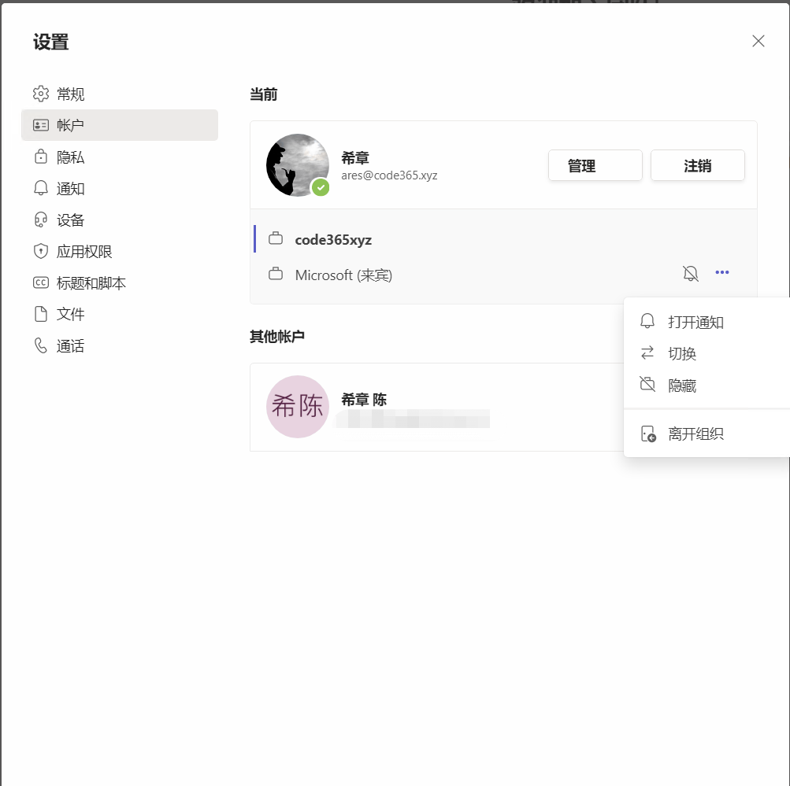

## 机器人和消息扩展

1. 机器人进行自然语言`对话`，或基于`命令`操作
1. 消息扩展可以用来`查询`生成消息，或者基于消息`执行`任务

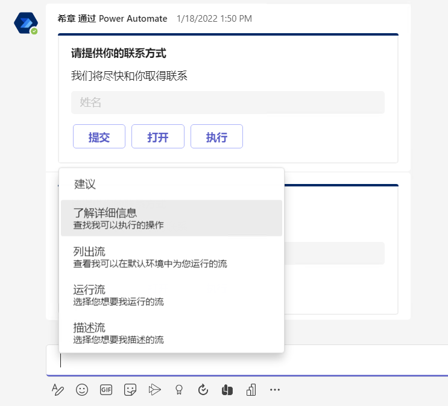
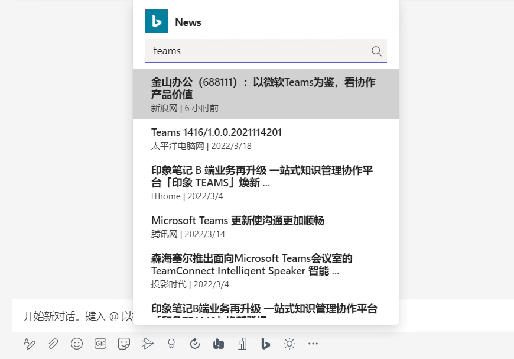

## 通过链接发起聊天

通过`深度链接` 技术，定义特殊格式的链接，可以发起聊天、群聊、会议等功能。可以定义作为邮件签名。

`https://teams.microsoft.com/l/chat/0/0?users=<用户1>,<用户2>,...&topicName=<群聊名称>&message=<初始化消息>`

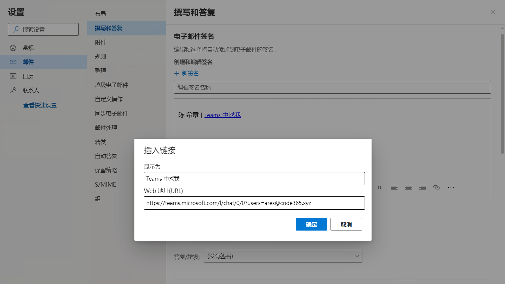

## 在聊天中使用社交元素

1. 通过 `@` 来提醒同事注意，支持 `@team` 和 `@channel` 
1. 支持对消息进行表情回应 

1. 完整的消息编辑器支持 （`Ctrl+Shift+X`）
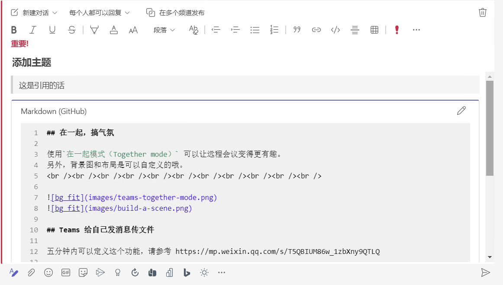
## 专用频道、共享频道

1. 专用频道，是只允许特定人看到的频道
1. 共享频道，是便于跟外部联系人沟通的频道。（对方不需要以来宾加入当前组织）

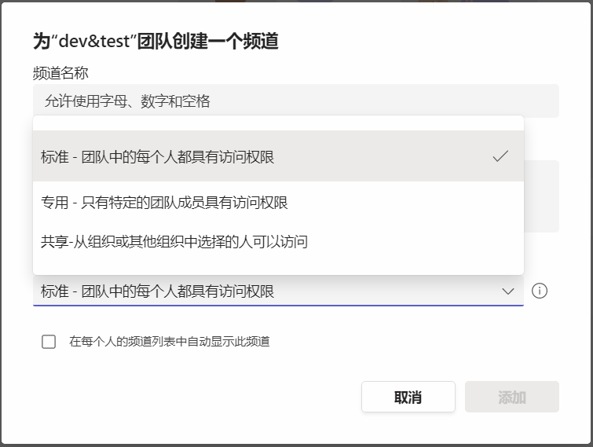

## 加入会议

1. 多种方式加入会议
1. 在不同设备中平滑切换

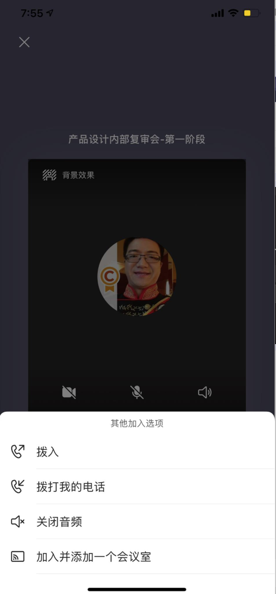
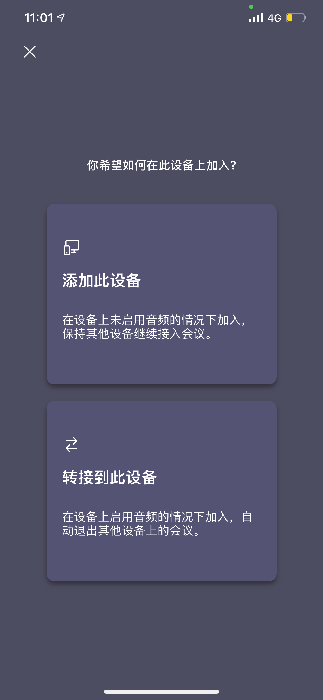

## 在一起，搞气氛

使用`在一起模式（Together mode）` 可以让远程会议变得更有趣。
另外，背景图和布局是可以自定义的哦。
           

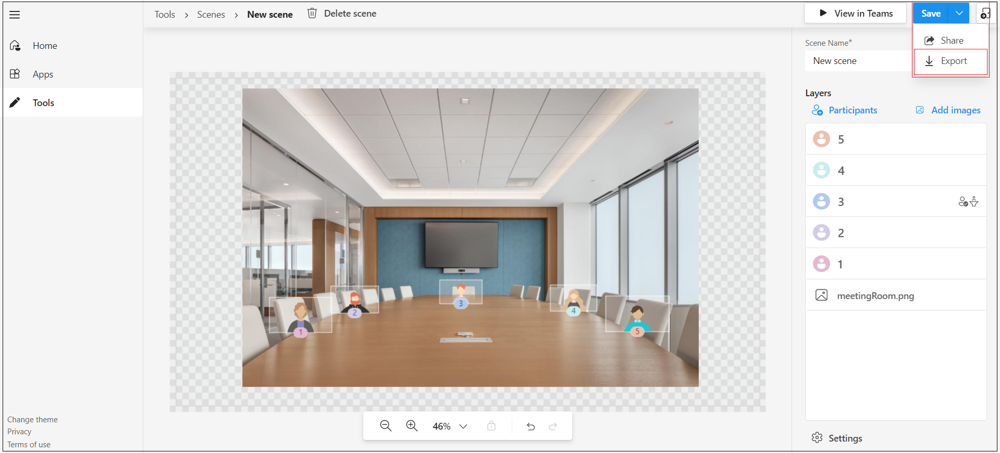

## Teams 给自己发消息传文件

五分钟内可以定义这个功能，请参考 https://mp.weixin.qq.com/s/T5QBIUM86w_1zbXny9QTLQ  

> 未来会原生提供此功能

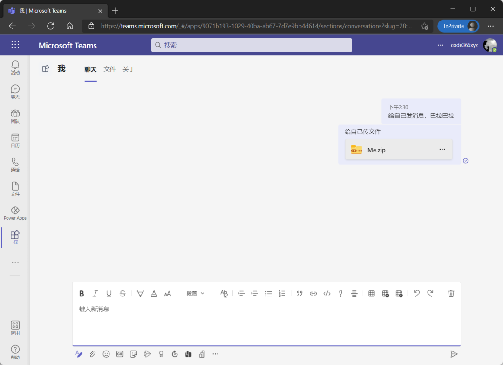

## 使用快捷键

`Ctrl+.` 唤出快捷键列表

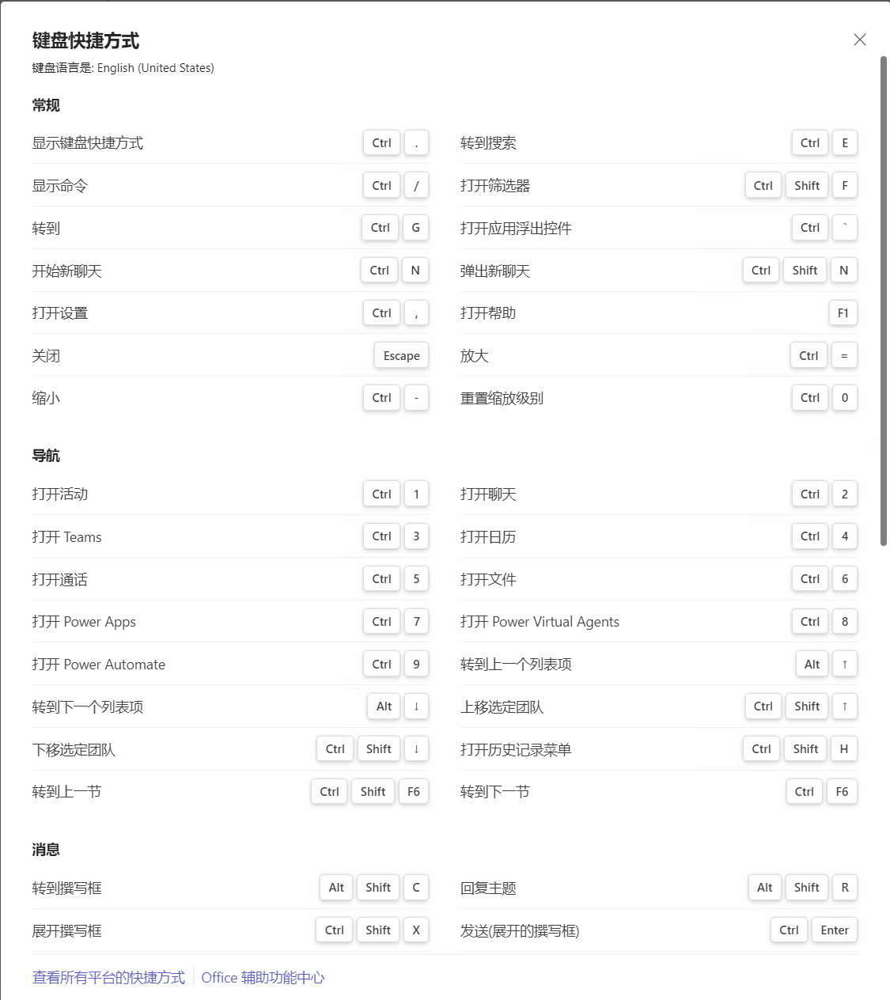

