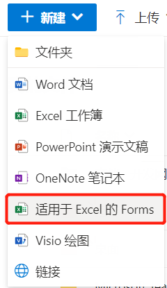

# Forms 居然可以这么玩
> 陈 希章 https://365pro.xizhang.com

## 免责声明 & 反馈讨论

> **以下分享为个人经验，不代表官方意见。**

## Forms 是用来做什么的
<!-- _backgroundColor: azure -->

Microsoft Forms 是一款轻量级的调查表或测验小工具，它是一个纯云端的服务，简约又不简单，安全且合规，由中国研发团队设计和开发, 推荐指数当然是 :star::star::star::star::star: ！

> 基本用法 https://support.microsoft.com/zh-cn/forms

## 使用分支设计表单流程

适合于多个步骤，并且前后步骤之间有逻辑上的关系。

## Forms 中的人工智能技术

1. 问题推荐
1. 选项推荐
1. 词云服务
1. 风格推荐
1. 在多个问题答案中找关联

## 多语言支持

根据浏览器设置自动切换

## 从OneDrive中创建Forms

这样的好处是，该表单结果将保存在一个固定的Excel文件中，而不是每次都动态生成。这样就可以针对这个文件，做一些后续的操作了。

## 在 Teams 聊天中使用Forms机器人

## 在 Teams 会议中使用Forms发起调查表

