# OneDrive 居然可以这么玩
> 陈 希章 https://365pro.xizhang.com

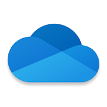

## 免责声明 & 反馈讨论

> **以下分享为个人经验，不代表官方意见。**

本教程的反馈以及问题讨论，我委托第三方开通了一个企业微信号，将利用业余时间给与解答。

## OneDrive 是做什么的
<!-- _backgroundColor: azure -->

通俗地说，Microsoft 365中的 OneDrive 服务就是你的个人网盘，它的全称是 `OneDrive for Business`, 这个与个人般的`OneDrive`是有区别的，首先在于容量（默认1TB），另外就是它有很多协作的功能。

OneDrive 分为云端服务和客户端两个部分。

> 基本用法 https://support.microsoft.com/zh-cn/office/onedrive-%E8%A7%86%E9%A2%91%E5%9F%B9%E8%AE%AD-1f608184-b7e6-43ca-8753-2ff679203132

## 自动备份文件夹

针对 `桌面`，`文档`，`图片` 文件夹

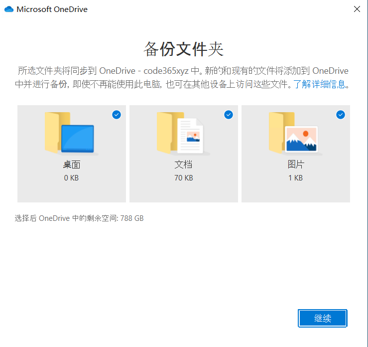

## 多种存储选项
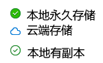
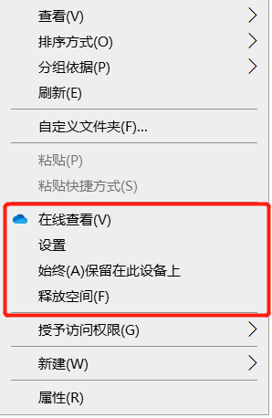

## 丰富的分享选项

1. 组织内分享
1. 匿名分享（到期，密码）
1. 编辑和只读，阻止下载 

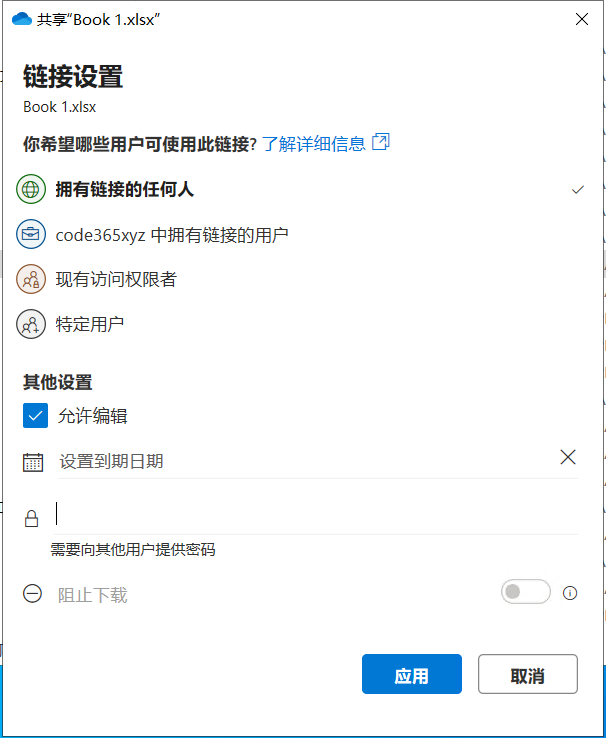

## 运行共享报告

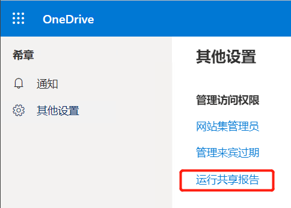

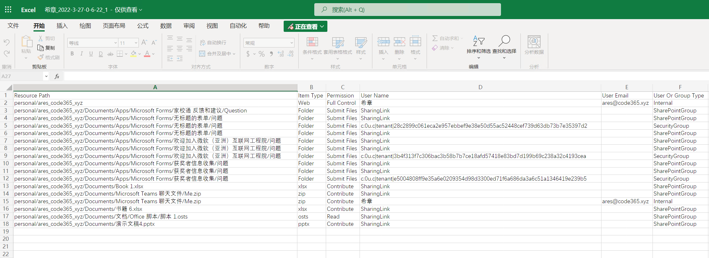

## 向 "我的文件" 添加快捷方式

不需要复制文件，随时跟踪有权限访问的文件

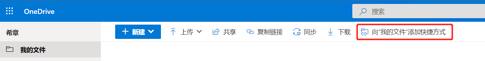
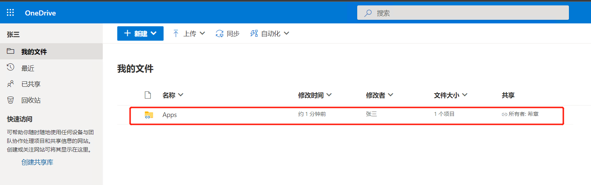

## 自动化

通过流程处理文档，可以通过Power Automate 进行定义

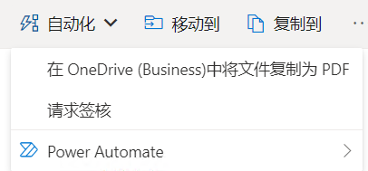
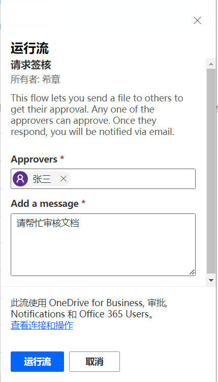
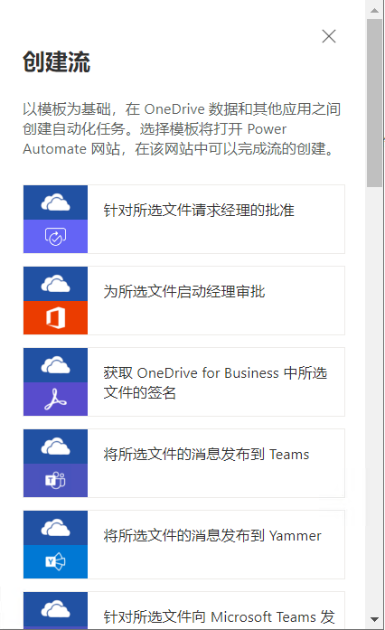

## 两级回收站，还可按日期还原

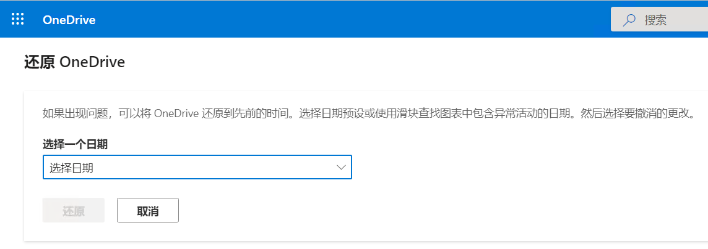

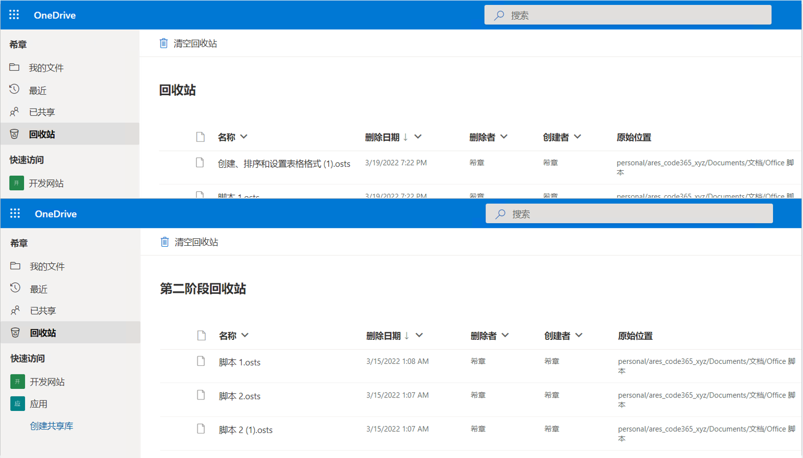

