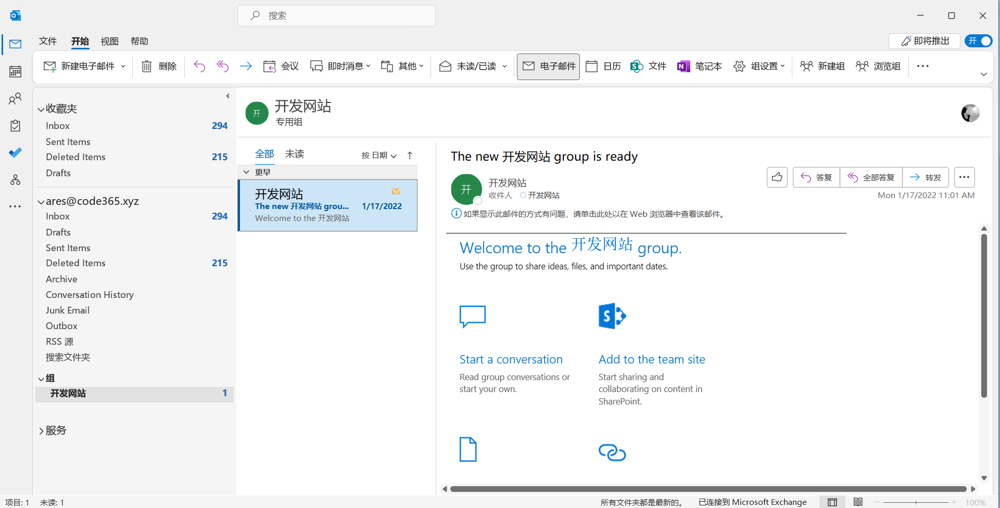

# Outlook 居然可以这么玩
> 陈 希章 https://365pro.xizhang.com

## 免责声明 & 反馈讨论

> **以下分享为个人经验，不代表官方意见。**

本教程的反馈以及问题讨论，我开通了一个企业微信号，将利用业余时间给与解答。

## Outlook 是做什么的
<!-- _backgroundColor: azure -->

Outlook 是 Microsoft 365 中的邮件客户端，但还不止于此，它与云端的（Exchange Online）服务配合，为用户提供了邮件、日程、联系人和任务管理等一系列功能。

> 基本用法 https://support.microsoft.com/zh-cn/outlook

## 配置Office 365邮箱账号

1. 自动发现，一键配置
1. 一站式管理邮件、会议、联系人和任务

## 高效地处理邮件
1. 高效处理邮件（4D）
`Delete -阅后即删`, `Do -立即回复`,
`Delegate - 转发（委派）`, `Delay（加标签，后续处理）`
1. 自动区分 `重点` 和 `其他` 邮件

<!-- https://support.microsoft.com/zh-cn/office/outlook-%E7%9A%84%E6%9C%80%E4%BD%B3%E5%81%9A%E6%B3%95-f90e5f69-8832-4d89-95b3-bfdf76c82ef8 -->

## 高效计划会议

1. 使用`日程安排助理`
1. 添加`会议室`

## 利用 Office 365 组进行协作

`邮件`，`组日历`，`共享文件`，`团队笔记本`，`权限控制`

## 共享到Teams
> 分享给单个人，或者频道
> 可以选择是否包含附件

## 网页版 Outlook 也很出色

1. 轻量级，任何设备都能快速开启
1. 可安装快捷方式，基于 PWA 技术

