# PowerPoint 居然可以这么玩
> 陈 希章 https://365pro.xizhang.com
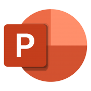

## 自动保存

如果文件保存在OneDrive for Business 或 SharePoint Online，则可以自动拥有这个特性，再也不用担心忘记保存文件了。

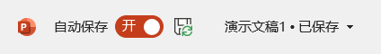

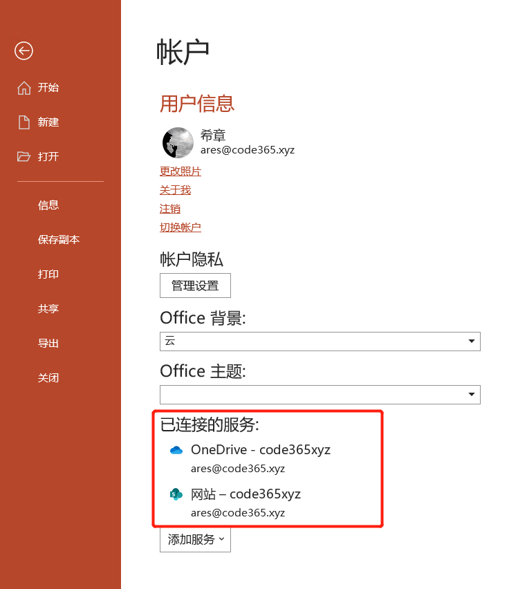

## 设置默认模板字体

中文版建议使用 `微软雅黑` 字体。通过 `视图`=> `幻灯片母版`,然后设置字体。

以 `blank.potx` 为文件名，保存到 `%AppData%\Microsoft\Templates` 这个目录。

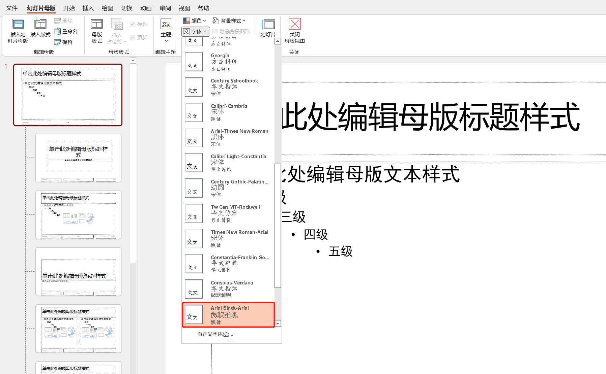

## 使用3D模型
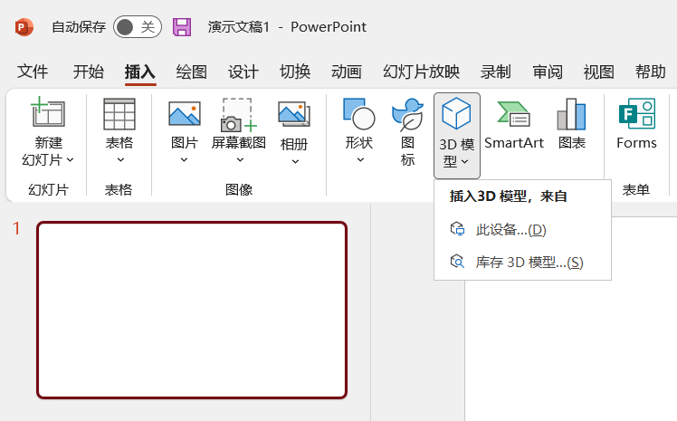

可以利用 `Paint 3D` 制作自己的3D模型。

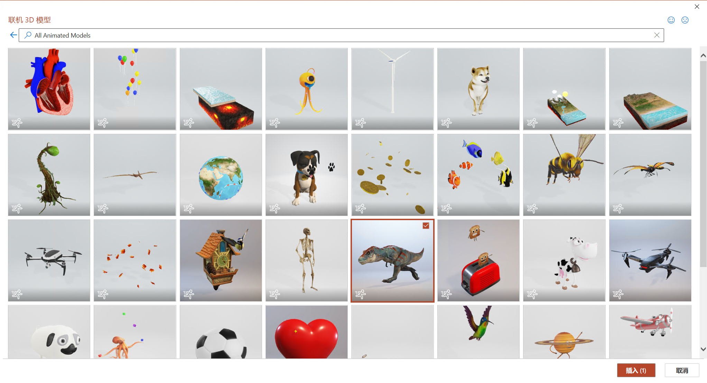
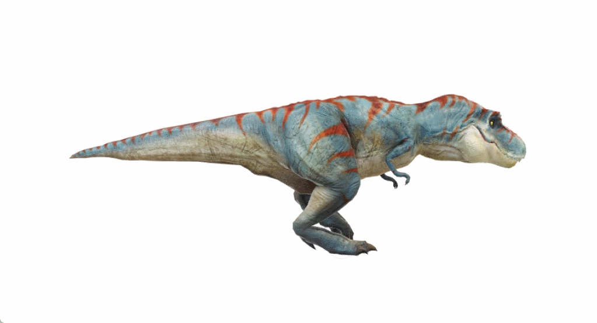

## 设计理念（灵感）

你负责`内容`，PowerPoint 负责`设计`

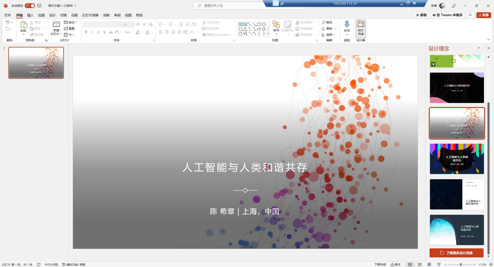

## 缩放定位

快速生成定位幻灯片：

`摘要`，`节`，`幻灯片`

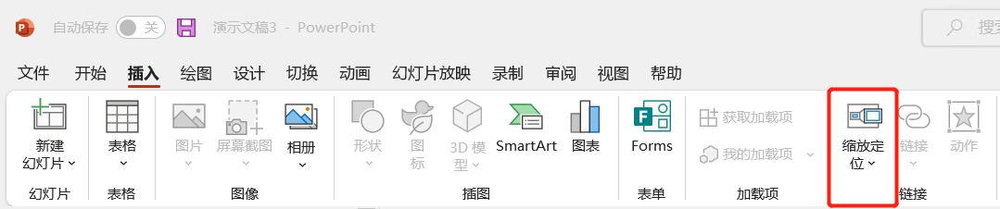

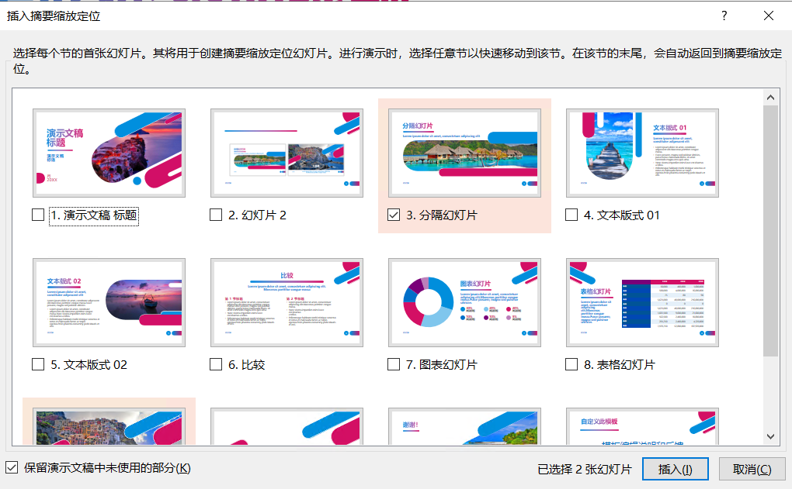

## 录制

`录制屏幕`: 录制桌面操作插入到PPT中
`录制演讲`: 讲完PPT即可得到一个视频

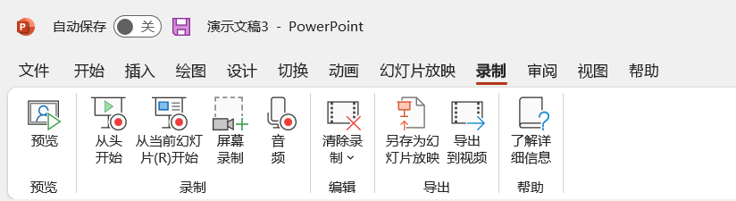

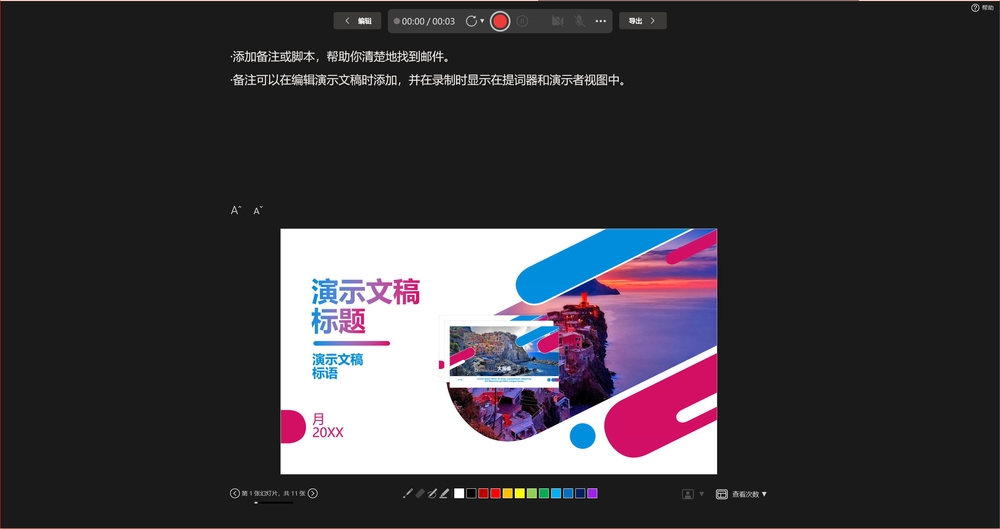

## 现场直播 (PowerPoint Live)

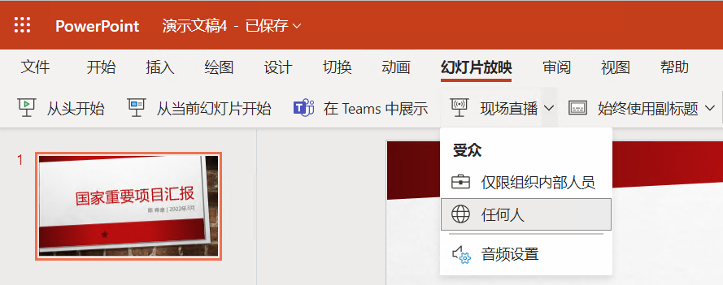

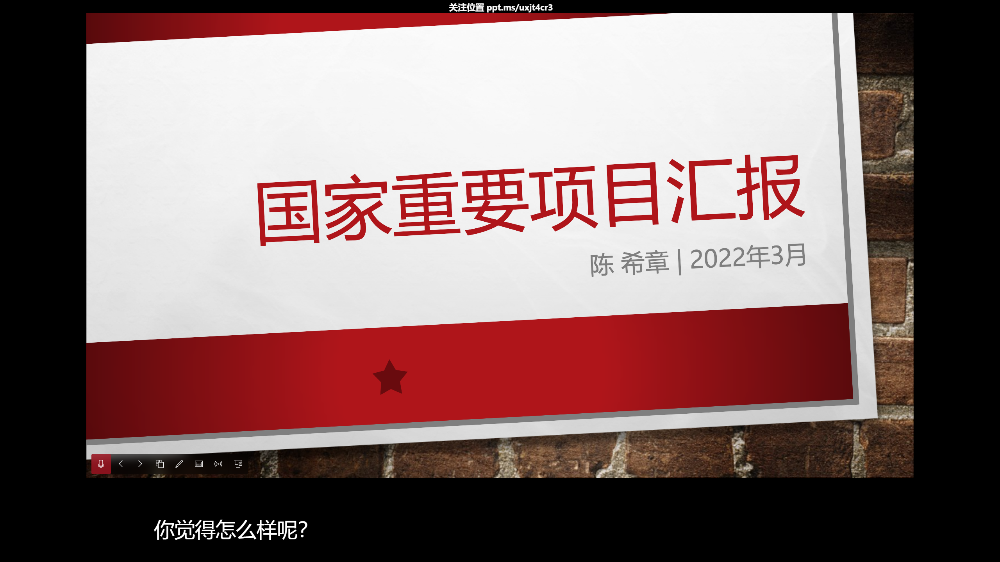
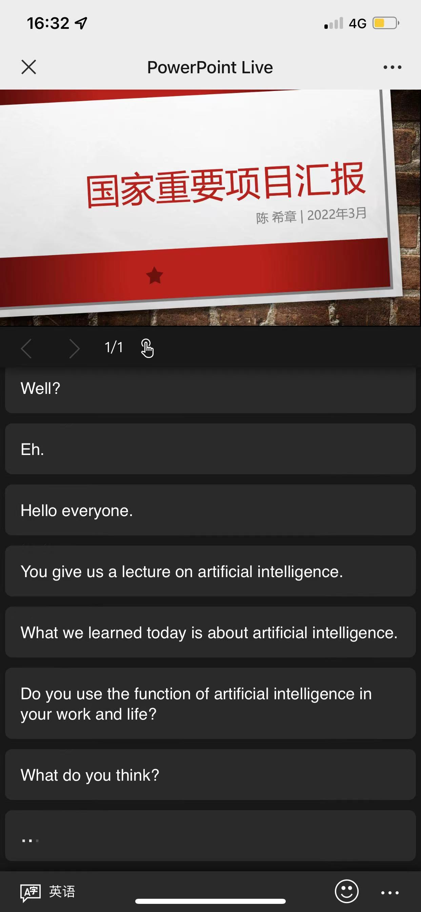