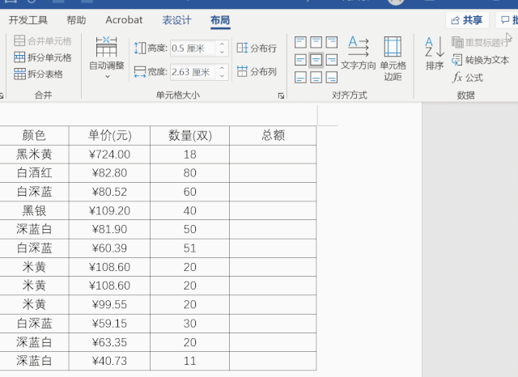
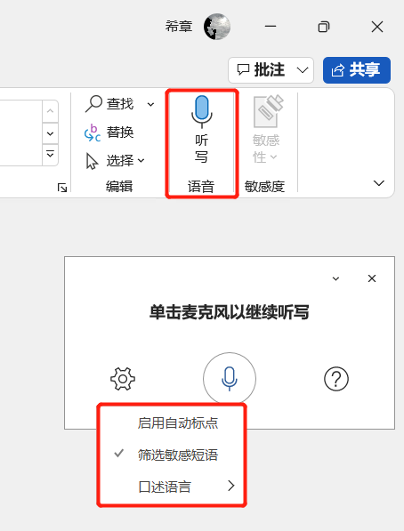
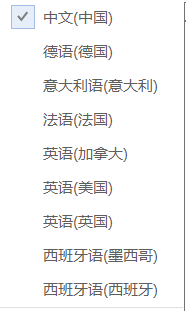
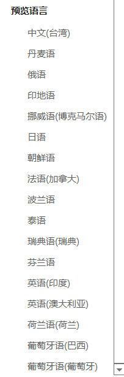
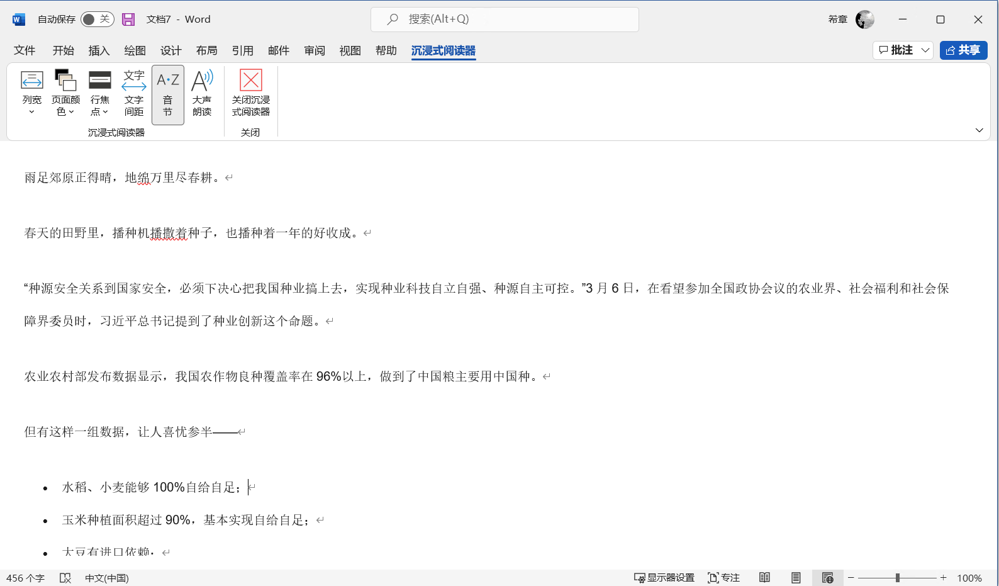
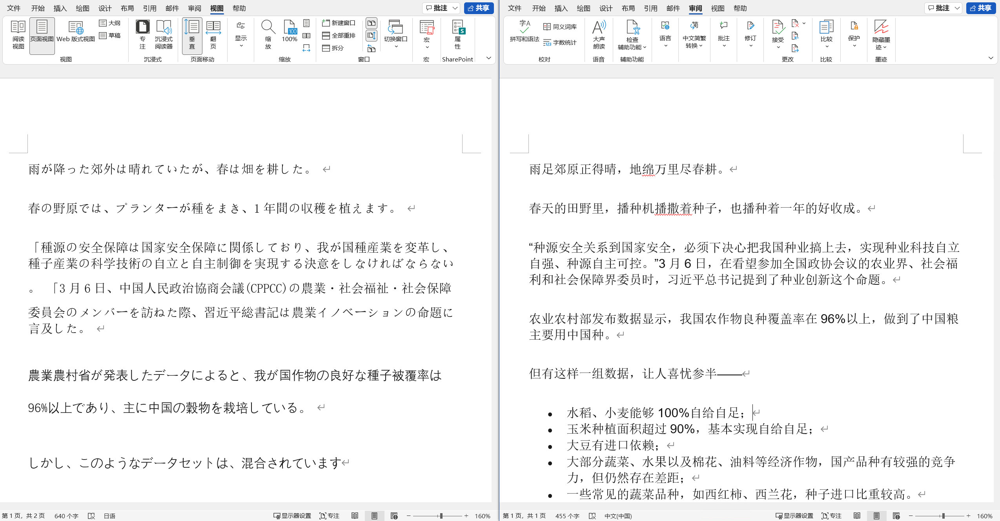
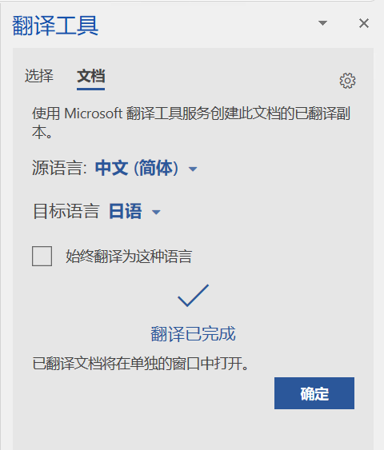
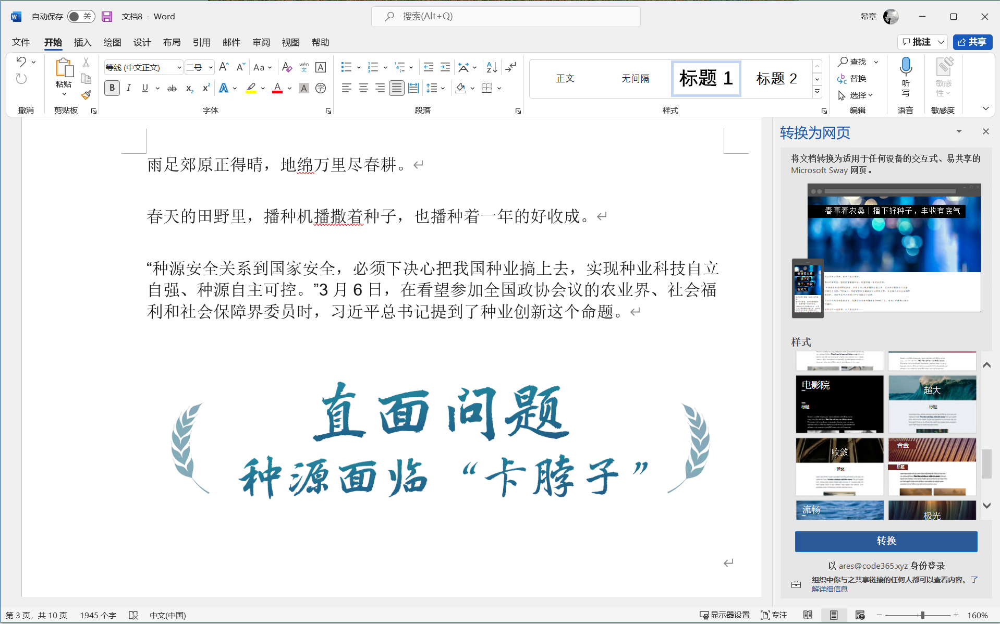

# word 居然可以这么玩
> 陈 希章 https://365pro.xizhang.com

## Word 也可以玩函数公式

1. 常见函数 
`SUM`,`PRODUCT`,`AVERAGE`
1. 计算方向 
`LEFT`,`RIGHT`,`ABOVE`,`BELOW`
1. 可使用坐标定位单元格
`B2`,`C2`
1. 彩蛋：在空白输入如下函数回车
`=rand()`,`=lorem()`

## 听写输入

1. 几十种语言支持
1. 支持标点符号推测
1. 敏感词过滤

## 沉浸式阅读器

用耳朵听文档

## 翻译文档

1. 简繁体转换
1. 翻译内容或整个文档

    

## 转换为网页(Sway)

<!-- https://sway.office.com/ZdxVnMdxGVTWp2w2?authoringPlay=true&publish -->

